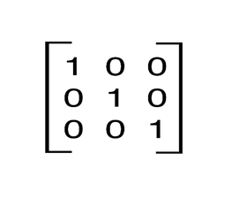

# Exercices

### A. Variables, opérateurs et structures conditionnelles

1. Supposez que vous ayez deux variables `a`et `b`. Écrivez le code permettant de permuter le contenu des deux variables.
2. Écrire le code permettant de conserver, dans une chaine de caractères, les deux première lettres et les deux dernières (de n'importe quelle chaine de caractères initiale). Si la chaine initiale contient moins que 4 caractères, le résultat devrait être une chaine vide.
3. Écrire un programme qui remplace toutes les occurences du premier caractère d'une chaine de caractères par des *, sauf le premier. Par exemple, si la chaine initiale était`nonne`, le résultat serait  `no**e`. 

### B. Structures de données

1. Écrire un programme qui construit une liste contenant exactement la première moitié des éléments d'une autre liste.
2. Sans utiliser la fonction reverse, écrire un programme qui inverse les éléments d'une liste. (*indice: pensez au découpage (slicing)*)
3. Écrire un programme qui génère crée une matrice identité de taille 3x3: 
   
   La matrice peut être représentée par une liste de listes (ci-dessous). Celle-ci doit être créée de façon automatique. 

```python
[ [1, 0, 0], 
  [0, 1, 0], 
  [0, 0, 1]]
```


## C. Les boucles

1. Écrire un programme qui affiche tous les éléments d'une liste en ordre inverse. 
2. Écrire un programme qui affiche tous les nombres multiples de 3 d'une liste d'entiers. 
3. Écrire un programme qui affiche tous les nombres multiples de 3 inférieurs à qui sont inférieurs à 100
4. Sans utiliser l

### C. Fonctions