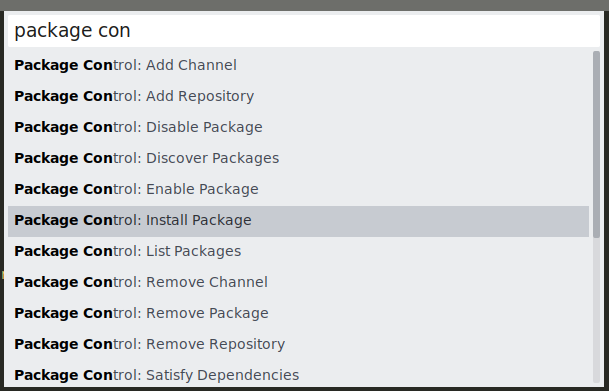
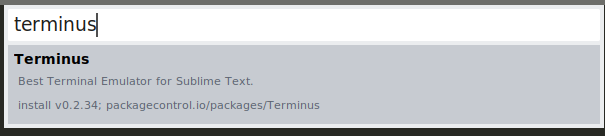

# L'éditeur Sublime pour développer en Python

L'interpréteur interactif *PyPy* est assez pratique pour tester des commandes, mais il n'est absolument pas adapté pour écrire des programmes. Pour ce faire, nous devons écrire le code de notre programme dans un éditeur afin d'être en mesure de le sauvegarder et de l'exécuter au besoin.

Plusieurs environnements de développement en Python existent sur le marché, dont:
- IDLE: l'éditeur fournit avec Python lorsqu'on le télécharge depuis [python.org](Python.org);
- PyCharm: disponible depuis [JetBrains](https://www.jetbrains.com/pycharm/download/) (commercial mais gratuit pour les étudiants);
- Spider: Disponible depuis [spider-ide.org](https://www.spyder-ide.org/)
- et bien d'autres.

Ces éditeurs offrent beaucoup de fonctionnalités qui aident au développement. Cependant toutes ces facilités offertes ne sont pas nécessaires à notre niveau et seraient même contre productives pour bien débuter. Nous allons donc utiliser un simple éditeur de textes: Sublime. Toutefois, Sublime offre quelques facilités bienvenues pour nous, notamment:
- la coloration syntaxique
- la possibilité d'exécuter le code directement depuis l'éditeur.

### Installation de Sublime

- Téléchargez Sublime depuis [sublimetext.com](https://www.sublimetext.com/download)
- Nous allons maintenant vérifier que Sublime est bien configuré pour la compilation en Python3. Créez un nouveau fichier contenant le code suivant:
```python
import sys 
print(sys.version)
```
- Sauvegardez le fichier en mettant `.py` comme extension (ex.: test.py)
- Exécutez le programme en pressant CTRL+B
- Vérifiez le numéro de version de Python qui s'affiche. 
- Si le numéro de version est dans la série 3.x.x, vous avez terminé.
- Sinon, vous devez configurer Sublime pour qu'il utilise la version 3 de Python. Pour ce faire [suive ce gist](https://gist.github.com/zaemiel/4fbd8b5125fda7a140be)

### Définition de l'encodage

Sublime stocke les fichiers textes, par défaut, avec un encodage en utf-8 et non ASCII (latin1). Pour ne pas avoir de problèmes avec les caractères spéciaux et pour ne pas qu'ils ne soient mal interprétés par l'interpréteur de Python, on doit spécifier l'encodage utilisé dans nos fichiers  `.py`. Nous faisons celà en ajoutant la ligne suivante en haut des fichiers de code: 

```python
# -*- coding: utf-8 -*-
```

Cette ligne devra donc être présente dans tous les programmes que nous écrirons. 

### Intégration d'un émulateur de terminal dans Sublime 

Bien que Sublime permette d'exécuter du code Python directement dans l'éditeur,   la fenêtre d'exécution n'est pas interactive et ne permet d'utiliser des fonctions telles que `input`.  Pour éviter cette limitation, nous allons installer un émulateur d'un vrai terminal dans Sublime.  Ainsi, nous pourrons lancer le programme avec l'interpréteur `python3` comme si nous étions dans un terminal. 

Pour ce faire: 

- Allez dans le menu "Tools" > "Command Palette..."
- Tapez "Package ", dans les choix proposés, choisir "Package control: Install package" 
  
- Tapez "Terminus" puis Entrée
  

* Retourner dans  "Tools" > "Command Palette..." et tapez "Terminus Key". Choisissez "Preferences: Terminus key bindings"

* Une nouvelle fenêtre s'ouvrira avec deux sous-fenêtres. Dans la fenêtre de gauche, remplacez le contenu par ceci: 

  ```
  [
      { 
          "keys": ["ctrl+alt+t"], 
          "command": "toggle_terminus_panel", 
          "args": {
              "cwd": "${file_path:${folder}}"
          }
      },
      { 
      	"keys": ["ctrl+alt+q"], 
      	"command": "terminus_close", 
      	"context": [{ "key": "terminus_view"}]
  	}
  ]
  ```

* Sauvegardez et fermez la fenêtre. Vous retrouverez votre fenêtre Sublime originale. 
* En pressant `CTRL+ALT+T` un terminal s'ouvrira en bas de votre fenêtre Sublime. En pressant CTRL+ALT+Q, celle-ci se fermera. 