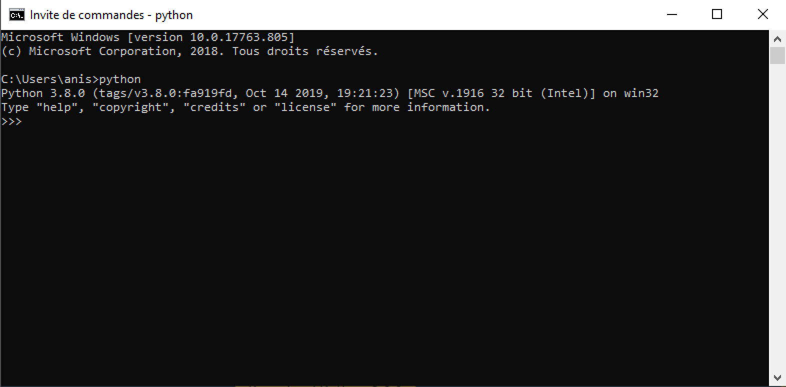
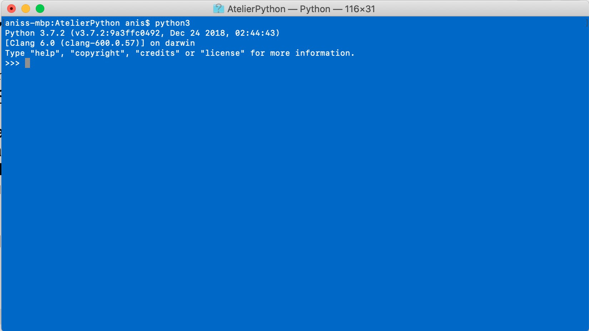

# Intallation de l'interpréteur Python

Afin d'être en mesure d'exécuter du code Python, l'interpréteur Python doit être installé dans votre système. L'interpréteur Python est disponible gratuitement sur [le site de python](https://www.python.org/) ou peut être installé directement à l'aide de gestionnaires de paquetages sur Linux et MacOS. Ce document détaille l'installation sur chacun des systèmes d'exploitation. 

## 1. Installation sur Windows

* Téléchargez et exécuter le fichier d'installation depuis la [page de téléchargement de Python](https://www.python.org/downloads/). La dernière version, à l'écriture de ce document, est la version 3.8.0.
  **IMPORTANT**: Dans le premier écran d'installation, assurez-vous de cocher la case *"Add Python 3.8 to PATH"*

* À la fin de l'installation, cliquez sur l'option *"Disable path length limit"* 

* Confirmez que l'installation s'est bien déroulée en ouvrant une fenêtre de console 
  (Bouton démarrer > et tapez `cmd`). Dans l'invite de commande, tapez la commande `python`. L'invite de commande de Python devrait alors s'afficher dans la console, après un message d'introduction mentionnant la version de Python que vous avez installée.

   


## 2. Installation sur MacOS

Typiquement, sur MacOS, la version 2 de Python est déjà installée. Cependant, cet atelier porte sur Python3 et ce dernier n'est pas rétro-compatible avec Python2 (des instructions en Python3 ne seront pas reconnues en Python2 et vice-versa). Il existe plusieurs façons d'installer Python3 sur MacOs mais, dans ce guide, nous utiliserons la méthode avec le gestionnaire de paquetages HomeBrew. Cet outil, si vous ne l'avez pas, devient vite un essentiel dans la vie d'un développeur-euse car il permet d'installer plusieurs types d'outils très simplement.

* Ouvrez un Terminal

* **Installation de Homebrew: ** Si vous avez déjà installé cet outil, vous pouvez passer cette étape. 
  Dans le terminal, copiez/collez la ligne suivante (*Note: c'est une seule ligne, même si celle-ci apparait en plusieurs lignes sur votre écran*) : 

  ```bash
  /usr/bin/ruby -e "$(curl -fsSL https://raw.githubusercontent.com/Homebrew/install/master/install)"
  ```

  Pour confirmer que l'installation s'est bien effectuée, tapez la commande suivante dans le terminal: 

  ```bash
  brew doctor
  ```

  Vous devriez obtenir un message du type *"Yous system is ready to brew"* 

* **Installation de Python 3:** Toujours dans le Terminal, tapez la commande suivante: 

  ```bash
  brew install python3
  ```

  Une fois l'installation terminée, vérifiez que celle-ci s'est bien déroulée en exécutant l'invite de commande Python. Pour ce faire, tapez la commande `python3`. Vous devrier obtenir l'invite de commande précédé par un message mentionnant la version de Python installée: 
  


## 3. Installation sur Linux

Python est généralement déjà installé sous Linux. Cependant, on doit s'assurer que c'est bien la version 3 qui est installée. En ouvrant un invite de commande, vous pouvez taper la commande: 

```bash
python --version
```

pour vérifier quelle version est installée. Dans certains cas, deux versions de Python sont installées, vous pouvez le vérifier en tapant une commande spécifique à Python 3: 

```bash
python3 --version
```

Si vous vous êtes assuré-e que Python 3 n'est pas installé sur votre machine, vous pouvez l'installer en utilisant le gestionnaire de paquetage de votre distribution Linux. Dans ce qui suit, on vous montre comment le faire sur une distribution basée sur Debian (ex.: Ubuntu, Mint, etc.). Si ce n'est pas votre cas, vous devez l'adapter à votre distribution en utilisant votre gestionnaire de paquetages (ex.: yum pour Fedora).

* Installez Python et PIP grâce à la commande suivante: 

  ```bash
  sudo apt install python3 python3-pip
  ```

* Une fois l'installation terminée, vérifiez que celle-ci s'est bien déroulée en exécutant l'invite de commande Python. Pour ce faire, tapez la commande `python3`. Vous devrier obtenir l'invite de commande précédé par un message mentionnant la version de Python installée: 
  

